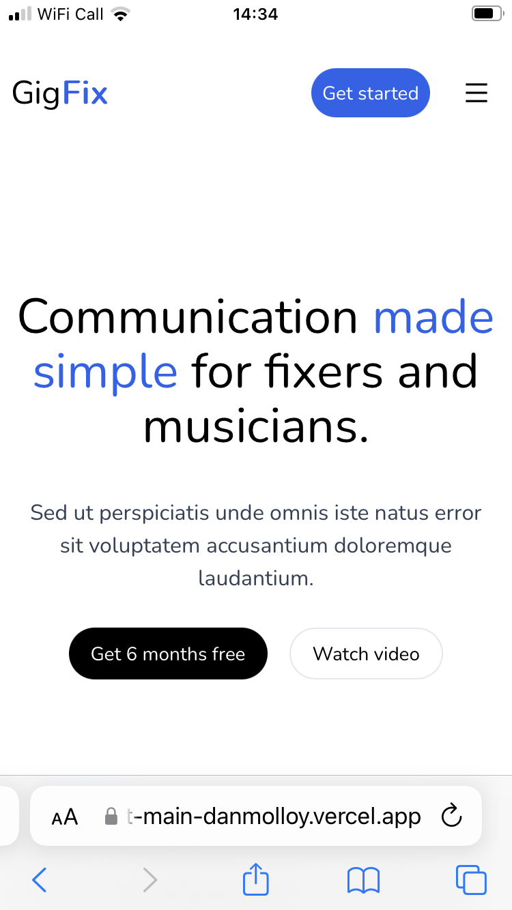
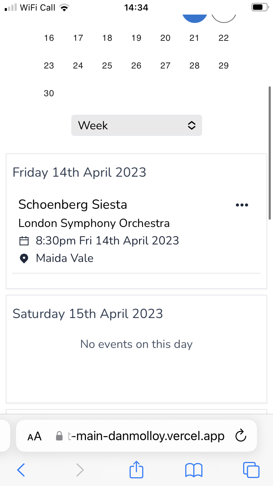
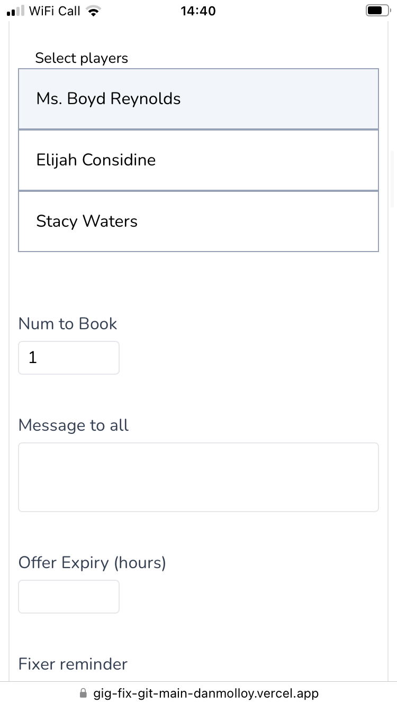
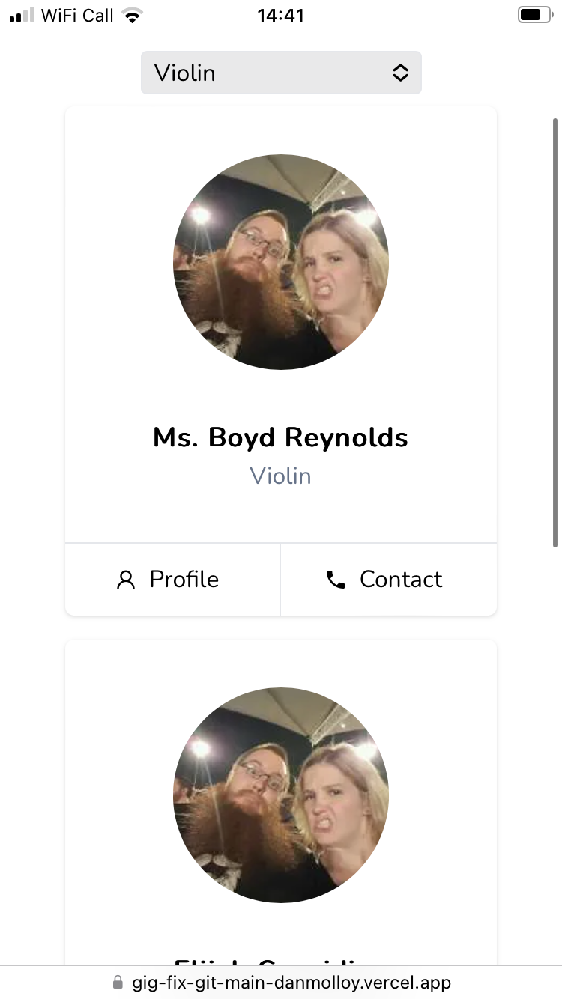
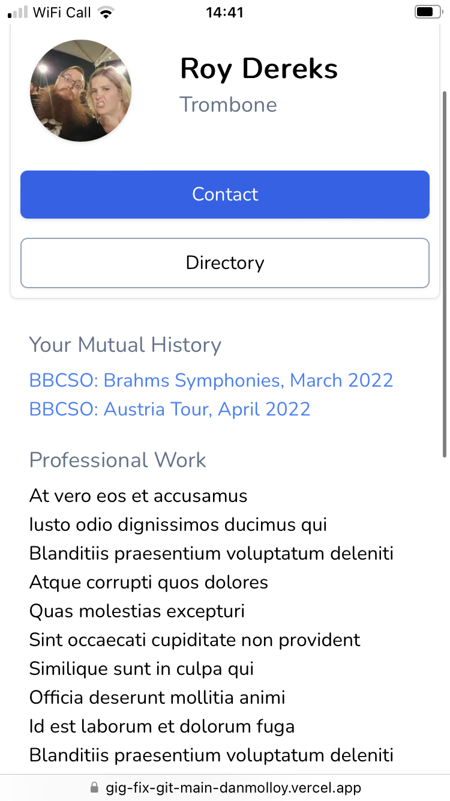

# Fixer

## Overview
For an orchestra manager, a.k.a a fixer, booking an ensemble of freelance musicians is a frequent, time consuming and tedious process. Fixer automates this work. It also assists them in managing their schedule and finding new players.

## Features
### Landing Page
I created a simple landing page loosely based on Tailwind UI [Salient template](https://salient.tailwindui.com/).

### Calendar
One can view all of their upcoming events, or choose a date range. I used [react-calendar](https://github.com/wojtekmaj/react-calendar) for the date picker. 

### Create an Event
To create an upcoming event, one fills out a simple form. Once it is validated and submitted, the event object is saved to the database and the user is redirected to the event page. 

### Event Page
As the central source of gig info for all involved, I've tried to make it as concise and readable as possible. There's a variety of options such as requesting practice parts or contacting other players.

### Event Fixing
The user can choose how many players they need for each instrument, then decide which players they'd like to contact from the directory. The are a variety of additional options in this section, such as automated offer expiry, automatic confirmation and personal messages. Once the 'Fix' button is click, text messages are sent via Twilio to the selected players.

### Directory 
An important aspect of the app is having a clear idea who is currently available for the work. I created user profile previews in the directory, which can be found under instrument selection.

### User Profile 
Players can upload a profile picture as well as list their relevant experience and education. Available to other users is a list of projects they've done together.

## Technical Overview
* Next.JS
* TypeScript
* Tailwind CSS
* Jest
* Prisma & PostgresQL
* Twilio